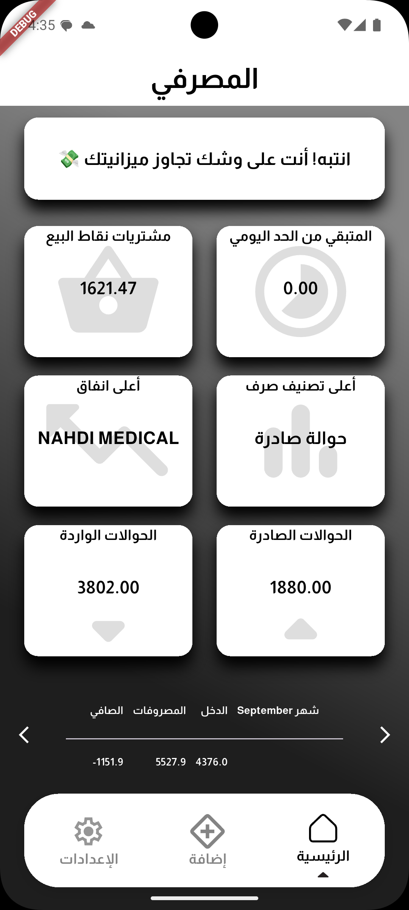
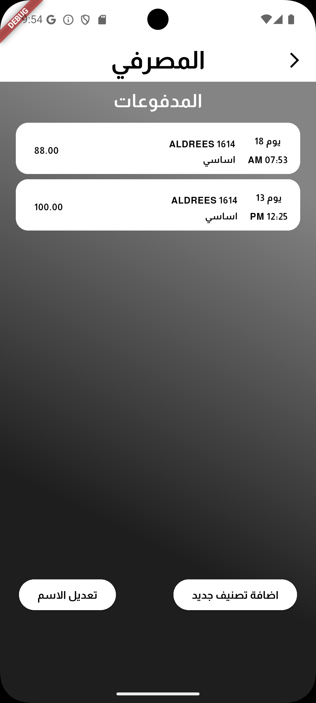

# 💳 Banker App

Banker is a personal finance management app built with **Flutter**.  
It automatically reads and analyzes your SMS messages from the bank, then extracts and categorizes your transactions to provide clear insights into your spending habits.  

With Banker, you can easily track your monthly expenses, set a daily spending limit based on your budget, and visualize your financial data in a clean and simple interface.

---

## ✨ Features

- 📩 **Automatic SMS Parsing**  
  Reads incoming bank messages and extracts transaction details.

- 📊 **Monthly Expense Reports**  
  Summarizes your spending for the current month and last 30 days.

- 💡 **Smart Categorization**  
  Transactions are grouped into categories such as **purchases, transfers, withdrawals, online payments**, and more.

- ⏳ **Daily Limit Tracking**  
  Helps you stay within your budget by monitoring your daily spending cap.

- 📁 **Expense History**  
  Navigate through past weeks and months to review old reports.

- 📷 **Screenshots**  
 
*Splash Screen*

*Home Screen*

*Monthly Expenses*

---

## 🛠️ Tech Stack

- **Framework:** [Flutter](https://flutter.dev/)  
- **Language:** Dart  
- **Database:** Local SQLite (for storing expenses and settings)  
- **Notifications:** Local notifications for budget alerts  

